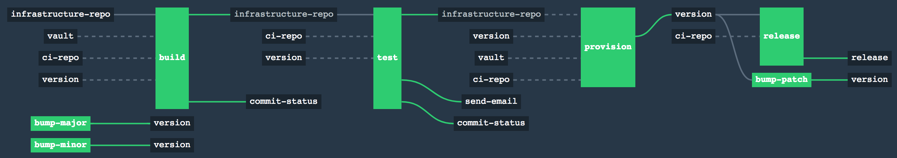

Concourse Pipelines
====================
This repository contains a collection of [Concourse CI](https://concourse.ci) pipelines used for AWS infrastructure provisioning. Each pipeline directory contains a `pipeline.yml` defining the pipeline, and a `settings.yml` file containing the expected parameters. The `scripts/ci` directory contain the scrips used by the templates.

### Pre-requisites

To configure a pipeline all settings in the `settings.yml` must be pre-populated, with sensitive data stored in Vault following Concourse's [credential lookup rules](http://concourse.ci/creds.html#vault). The [yaml2vault.py](scripts/tools/yaml2vault.py) can be used to write secrets from a yaml file to Vault.

To pipeline templates require Concourse to be setup and configured with Vault for secrets management. A [vagrant box](Vagrantfile) is provided this repository with a sample Concourse setup for local testing.

### Pipeline setup

A pipeline can be setup with the following commands

```bash
fly --target lite login -c ${CONCOURSE_URL}
fly --target lite set-pipeline --pipeline ${PIPELINE_NAME} --config pipeline.yml -n --load-vars-from settings.yml
fly --target lite unpause-pipeline --pipeline ${PIPELINE_NAME}
```

Pipeline Templates
-------------------

### pipeline-terraform-commit

Handles AWS infrastructure provisioning workflow using [terraform](https://terraform.io), [Vault](https://vaultproject.io) (AWS backend), [terrascan](https://github.com/cesar-rodriguez/terrascan) (for static code analysis), and AWS S3 for storage of terraform plans. The pipeline is triggered through commits to a specified branch.



#### How it works

Jobs:
- Build: Makes sure that terraform is formatted and runs `terraform plan`, storing the output in S3.
- Test: Runs [terrascan](https://github.com/cesar-rodriguez/terrascan) to check for any security/operational issues in the code. An email is sent if successful.
- Provision: Needs to be manually triggered to run `terraform apply` in all environments with changes. This will create a GitHub release.
- Versioning: Manual jobs can be triggered to bump the semantic version of the releases. The [create_version_branch.sh](scripts/tools/create_version_branch.sh) script helps setup the target repository for versioning.

#### Setup:

The following resources need to be configured in `settings.py`
- Vault for AWS STS token access - The [vault-aws-setup.sh](scripts/tools/vault-aws-setup.sh) script contains a sample configuration of Vault's AWS secret backend.
- SMTP - Email notifications are sent when a commit has successfully completed the testing job
- S3 bucket - The terraform plans are stored in S3
- GitHub - The repository containing the terraform templates needs to be provided in addition to a personal access token and access keys.
